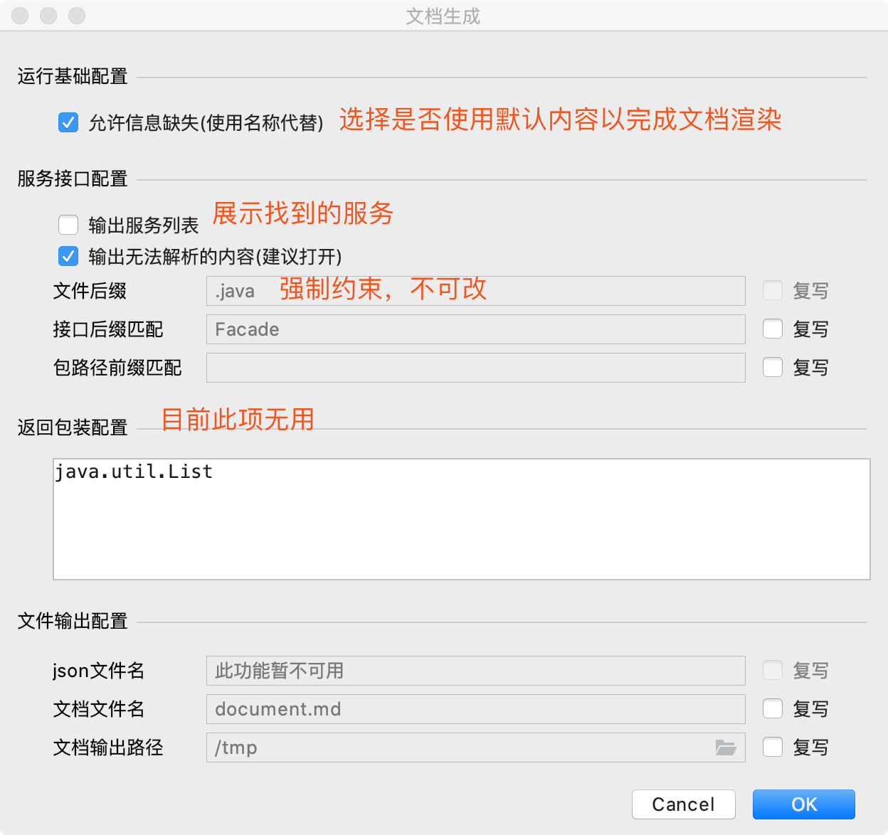

# 接口文档生成工具

面向接口(`interface`)的接口文档生成工具。

# 使用方式
在符合要求的`IDEA`中，单击选择`Tools` -> `Coding Helper` -> `Build Service Document`，
进入文档生成配置对话框，缺定后文档开始自动生成。

。

# 使用注意

- 生成的文档默认位于`/tmp`，可修改
- 生成的文档默认名为`document.md`，可修改
- 避免无意义的注释，否则可能导致文档中出现非预期内容

# 使用建议

- 所提示的注释缺失，应尽可能补齐